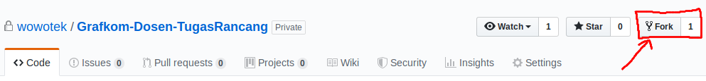

# Grafkom-Dosen-TugasRancang

> Tugas Ini di rilis oleh  **Erlangga Ibrahim** secara terbuka (*Open Source*)
> Dibawah Lisensi **GNU GPLv3**. untuk keterangan dan informasi lebih lanjut mengenai
> Lisensi, dapat dibuka di : https://www.gnu.org/licenses/gpl-3.0.en.html
> atau dengan membaca file `LICENSE`
>  
> Semua sumber yang digunakan pada tugas ini, dapat dilihat pada :
> https://github.com/wowotek/Grafkom-Dosen-TugasRancang
>  
> **PERINGATAN** : *Tugas ini dirilis **setelah tenggat waktu** pengumpulan tugas, dan tidak akan berlaku untuk kolega dengan tenggat waktu pengumpulan yang sama*
>  
> **PERINGATAN** : *Tugas ini dirilis **tanpa garansi**, termasuk nilai yang di-nihilkan oleh sebab **mencontek** dan/atau **menyalin** dan/atau **meniru** yang bersumber dari tugas ini*

## Pengawas / Dosen

* **Pratyaksa Ocsa Saian** - *@pratyaksaocsa*

## Penulis

* **Aurelia Gabriele** (672017277) - *@aureliagbrl*
* **Erlangga Ibrahim** (672017282) - *@wowotek*

## Deskripsi Tugas

> NOTE : Belum ada ketentuan dari dosen terkait. harap update ini segera setelah mendapatkan ketentuan resmi dari dosen terkait
buat tugas susah pokoke

### Pembakuan

> NOTE : Belum ada ketentuan dari dosen terkait. harap update ini segera setelah mendapatkan ketentuan resmi dari dosen terkait

## Kontribusi

untuk melakukan kontribusi, ada beberapa hal yang perlu diketahui bebrapa diantaranya adalah :

### Panduan Penamaan File

Ketika membuat source file baru, mohon gunakan standard sebagai berikut:

* Implementation File
  * nama file implementasi harus menggunakan huruf kecil
  * ekstensi file implementasi harus menggunakan **`*.cc`** melainkan **`*.cpp`**
    * *contoh :* __`render.cc`__
  * sangat disarankan hanya menggunakan satu buah kata 
    * *contoh :* __`entities.cc`__
  * jika lebih dari satu, kedua kata menggunakan huruf kecil, tanpa pemisah
    * *contoh :* __`makanankucing.cc`__
* Header / Definition File
  * nama file implementasi harus menggunakan huruf kecil
  * ekstensi file implementasi harus menggunakan **`*.hh`** melainkan **`*.h`** atau **`*.hpp`**
    * *contoh :* __`render.hh`__
  * sangat disarankan hanya menggunakan satu buah kata 
    * *contoh :* __`entities.hh`__
  * jika lebih dari satu, kedua kata menggunakan huruf kecil, tanpa pemisah
    * *contoh :* __`makanankucing.hh`__

### Panduan *Coding Style*

*Coding style* yang digunakan adalah gabungan dari **_GNU Coding Standards_** dan **_Object Pascal Style_** berikut penjabaran lebih lengkap mengenai kedua style tersebut :

* **GNU Coding Standards** : https://www.gnu.org/prep/standards/standards.html
* **Object Pascal / Delphi Style** : https://edn.embarcadero.com/article/10280

#### Gambaran Umum

Secara singkat berikut contoh gabungan dari kedua standard tersebut:

```c++
                                // Semua Comment harus sejajar dengan comment yang lain
#include <iostream>             // semua library standard harus ada diatas library-
#include <string.h>             // yang anda buat

#include "control.h"            // library anda harus ada setelah library standard

int exitCode = 0;               // nama variabel harus mengikuti gaya 'camelCase'

void RenderDisplay(void);       // definisi Fungsi mengikuti gaya standar C

void                            // tipe data implementasi fungsi harus ada diatas nama fungsi
RenderDisplay(void)             // nama fungsi dan definisi parameter harus mengikuti-
{                               // gaya Object-Pascal / Delphi
      ...
}

template <typename T> struct    // tipe data, dan definisi template mengikuti gaya-
vec2f_t {                       // GNU Coding standard
    T x, y;
    ...  
}

int                             // mohon gunakan integer sebagai tipe data fungsi utama
main(int argc, char ** argv)
{
    ...

    return exitCode;
}
```

#### Implementation File

Setiap Implementation File / Header file, diwajibkan menggunakan proteksi header

berikut adalah contoh pada file **`makanan.hh`**

```c++
#ifndef MAKANAN_HH // Proteksi Header
#define MAKANAN_HH // Buka Proteksi Header

// Code utama mulai disini
class Makanan{
  public:
    Makanan(int, int);
  private:
    void makan(Makanan);
}

void Makanan::Makanan(int x, int y);
void Makanan::makan(Makanan makanan);
// Code utama selesai


#endif // Tutup Proteksi Header
```

#### Penjelasan Lisensi Pada Source File

Setiap File diwajibkan menautkan potongan lisensi berikut pada baris pertama pada file tersebut

```txt
<Satu baris penjelasan singkat mengenai apa yang dilakukan file ini>
Copyright (C) 2019  Erlangga Ibrahim, Aurelia Gabriele, <Nama Anda>

This program is free software: you can redistribute it and/or modifyv
it under the terms of the GNU General Public License as published by
the Free Software Foundation, either version 3 of the License, or
(at your option) any later version.

This program is distributed in the hope that it will be useful,
but WITHOUT ANY WARRANTY; without even the implied warranty of
MERCHANTABILITY or FITNESS FOR A PARTICULAR PURPOSE.  See the
GNU General Public License for more details.

You should have received a copy of the GNU General Public License
along with this program.  If not, see <https://www.gnu.org/licenses/>.
```

contoh tautan potongan lisensi pada file **`makanan.hh`**

```c++
/* Mendefinisikan class makanan dan metoda metoda penunjangnya
 * Copyright (C) 2019  Erlangga Ibrahim, Aurelia Gabriele
 * 
 * This program is free software: you can redistribute it and/or modify
 * it under the terms of the GNU General Public License as published by
 * the Free Software Foundation, either version 3 of the License, or
 * (at your option) any later version.
 * 
 * This program is distributed in the hope that it will be useful,
 * but WITHOUT ANY WARRANTY; without even the implied warranty of
 * MERCHANTABILITY or FITNESS FOR A PARTICULAR PURPOSE.  See the
 * GNU General Public License for more details.
 * 
 * You should have received a copy of the GNU General Public License
 * along with this program.  If not, see <https://www.gnu.org/licenses/>.
 **/

#ifndef MAKANAN_HH
#define MAKANAN_HH

class Makanan{
  public:
    Makanan(int, int);
  private:
    void makan(Makanan);
}

void Makanan::Makanan(int x, int y);
void Makanan::makan(Makanan makanan);

#endif
```

### *Forking* dan *Cloning* Repository

setelah memahami beberapa panduan diatas, anda dapat mulai melakukan kontribusi dengan melakukan *Forking* lalu *Clone* dengan :

1. **Forking**:
fungsi forking adalah membuat branch baru dengan project baru pada akun personal anda, jadi tidak mengganggu project utama


2. **Cloning**

    ```bash
    git clone https://github.com/wowotek/Grafkom-Dosen-TugasRancang
    ```
